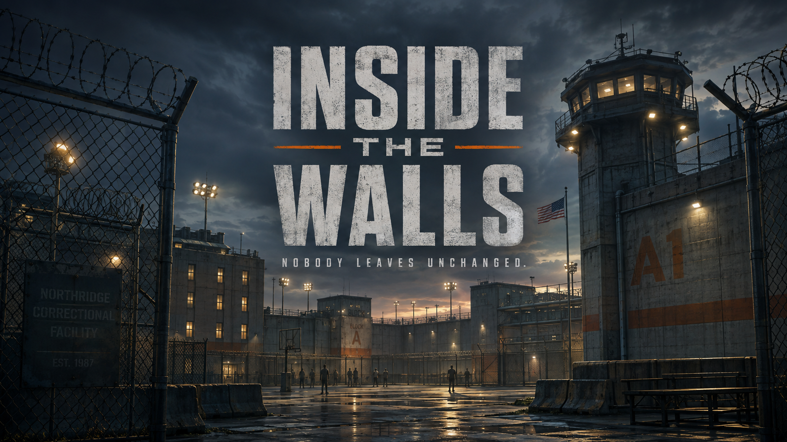

# Inside the Walls

**Current version: v2.05 - Playable Alpha**

> **Nobody leaves unchanged.**

**Repository:** [Troublez905/Inside-the-Walls](https://github.com/Troublez905/Inside-the-Walls)

**Inside the Walls** is a planned third-person, persistent online prison simulator built with Unity. Up to 50 players will share a living institution as inmates or correctional officers, while AI-controlled characters keep its routines, jobs, relationships, and conflicts moving when the server is below capacity.

The project is currently in **pre-production**. The first goal is a focused playable vertical slice, not the complete game described below.

## The Game

Every player enters the same institution from a different side.

### Inmate Path

Begin at intake as a new arrival. Learn the schedule, receive housing and work assignments, build relationships, and decide how to survive your sentence. Players may pursue education and legitimate work, develop social influence, take calculated risks, or become involved in underground activity. Reputation, favors, debts, and conflicts persist across sessions and transfers.

### Officer Path

Report for a first shift as a probationary correctional officer. Learn institutional procedures, supervise movement, work assigned posts, respond to incidents, and build rapport without losing control of the unit. Strong performance can lead from correctional officer to senior officer, lieutenant, captain, associate warden, and eventually warden.

## Planned Features

- Downloadable Windows PC release, with mobile considered after the PC version is stable
- Third-person movement and situational camera
- Persistent prisons supporting up to 50 human players
- Dedicated, server-authoritative multiplayer architecture
- AI inmates and staff filling essential roles below server capacity
- Inmate and correctional-officer career paths
- Living schedules with intake, counts, meals, work, programs, recreation, and lockdowns
- Relationships, memory, trust, reputation, favors, debts, and grievances
- Work assignments, education, vocational programs, commissary, and approved property
- Incident reporting, investigations, discipline, classification, transfers, and appeals
- Multiple facility types ranging from minimum security to specialized institutions
- Stylized-realistic presentation with mature themes and restrained gore

## First Playable Vertical Slice

The first milestone will contain one small low-security institution and one complete playable day:

1. Choose inmate or correctional officer.
2. Complete inmate intake or an officer shift briefing.
3. Receive a housing assignment or staff post.
4. Participate in count, meal movement, work, yard, and lockdown.
5. Complete one role-specific job and one social interaction.
6. Experience one minor rule violation and its review process.
7. Save, disconnect, reconnect, and restore the correct persistent state.

Initial multiplayer tests will use two clients, followed by 8-12 players or simulated clients. Testing at the full 50-player target will begin only after the core simulation is stable.

## Facility Progression

Facilities are persistent worlds rather than disposable match maps:

- **Intake and Transfer Center:** Onboarding, screening, orientation, classification, and transport
- **Minimum Security:** Open movement, work, programs, and release preparation
- **Low Security:** Structured movement, larger departments, and developing social politics
- **Medium Security:** Cell housing, tighter controls, and more complex safety concerns
- **High Security:** Closely managed movement, intensive supervision, and high-pressure decisions
- **Administrative Facilities:** Medical, transfer, protective, restricted, and other special missions

Higher security is normally a classification or safety consequence, not an inmate promotion. Character growth, social influence, institutional status, education, and career development use separate progression systems.

## Technical Direction

- Unity and C#
- Dedicated, server-authoritative simulation
- Server-owned inventory, money, damage, discipline, permissions, and progression
- Persistent player, relationship, and facility state
- Shared role framework for human and AI-controlled characters
- Interest management and budgeted AI updates for scalability
- Modular systems separating networking, simulation, persistence, UI, and presentation
- Automated tests for authority, transactions, persistence, reconnects, and role permissions

Networking, backend, database, and hosting technologies will be selected after a small technical prototype compares their requirements and tradeoffs.

## Art Direction

The visual style combines grounded correctional architecture with readable, slightly simplified game art. Concrete gray, desaturated blue-green, worn steel, faded safety yellow, and restrained orange accents form the core palette. Lower-security environments should feel brighter and more open; higher-security environments should feel denser and more controlled.

Violence may have visible consequences, but the project will avoid graphic gore and suffering as spectacle.

## Representation

The game may represent different ethnicities, nationalities, cultures, and religions through respectful character customization and roleplay. Identity will never automatically determine criminality, morality, aggression, statistics, hostility, or faction membership. Relationships and affiliations will develop through choices, shared interests, history, and trust.

The prison system is fictional and draws general inspiration from North American correctional structures. It is not intended to reproduce the policies or layout of a specific real institution.

## Development Roadmap

- **Pre-production:** Game vision, system design, facility plan, character bible, and art guide
- **Offline prototype:** Movement, camera, interactions, schedule, roles, and local saving
- **Multiplayer foundation:** Dedicated server, synchronization, authority, and reconnection
- **Living simulation:** AI schedules, relationships, jobs, economy, incidents, and discipline
- **Vertical slice:** One polished facility and complete playable day for both roles
- **Scale testing:** Increased clients, interest management, AI optimization, and moderation
- **Expansion:** Additional facilities, careers, programs, transfers, reentry, and mobile research

## Project Status

The Unity 6.3 LTS URP foundation now boots into a responsive title screen with keyboard, mouse, and controller navigation. New Game opens a two-role selection screen and a small third-person gray-box interaction for the signature “Missing Ten Minutes” scenario. Continue remains honestly disabled until persistence exists.

### Run the foundation build

1. Install Unity `6000.3.0f1` with Windows Build Support through Unity Hub.
2. Clone this repository and open its root folder as the Unity project.
3. Open `Assets/_InsideTheWalls/Scenes/Boot/Boot.unity` and enter Play Mode.

The checked-in Editor build command is `InsideTheWalls.Editor.FoundationBuild.ValidateAndBuild`; it validates the menu rules and creates a Windows development player at `Builds/Windows/InsideTheWalls.exe`. Generated builds are intentionally ignored by Git.

Current visual proof: [foundation menu at 1280×720](Docs/Screenshots/foundation-menu.png).

## Contributing

The project is not yet accepting general contributions. Once the Unity foundation and repository standards are established, this section will document setup, branching, code style, testing, asset requirements, and issue reporting.

## GitHub Workflow

The canonical repository is `https://github.com/Troublez905/Inside-the-Walls`.

- Authenticate locally with GitHub CLI (`gh auth login`) or a credential manager.
- Store automation credentials in GitHub Actions secrets or a local environment variable.
- Never commit, paste into prompts, or write personal access tokens into project files.
- Grant tokens only the permissions required for the specific operation and rotate exposed credentials immediately.
- Use feature branches and pull requests for reviewed changes once active development begins.

## License

Code in this repository is distributed under the GNU General Public License v3.0; see `LICENSE`. Supplied or generated visual references may have separate provenance requirements and must not be treated as production-ready until their rights are recorded in the graphics register.
